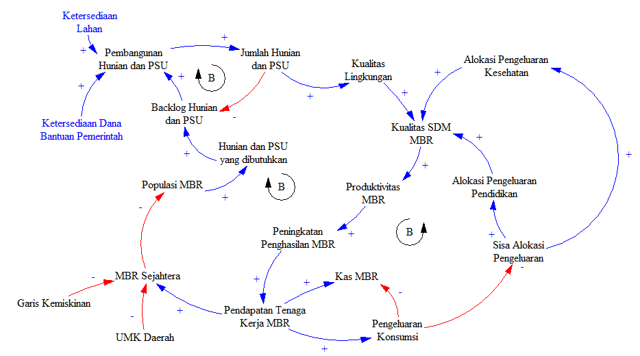
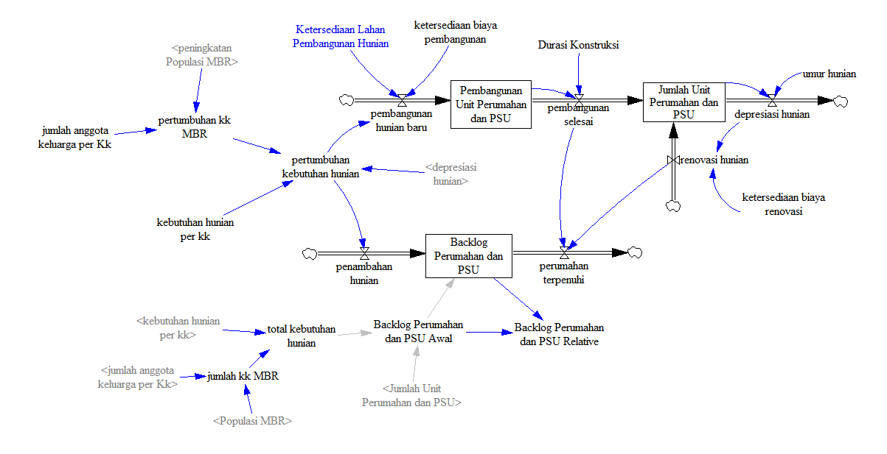
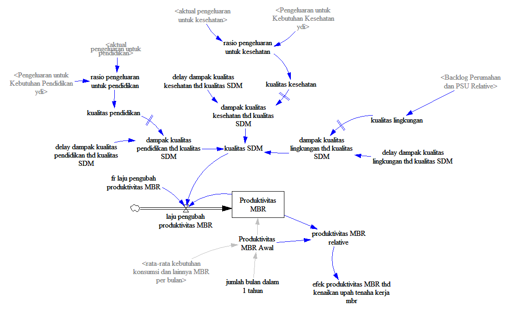
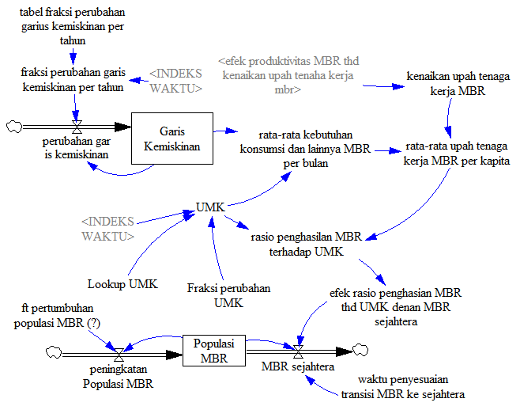
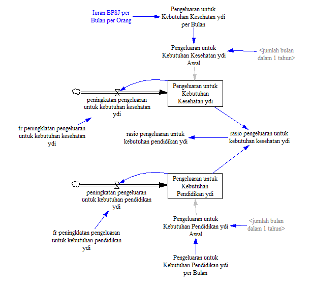
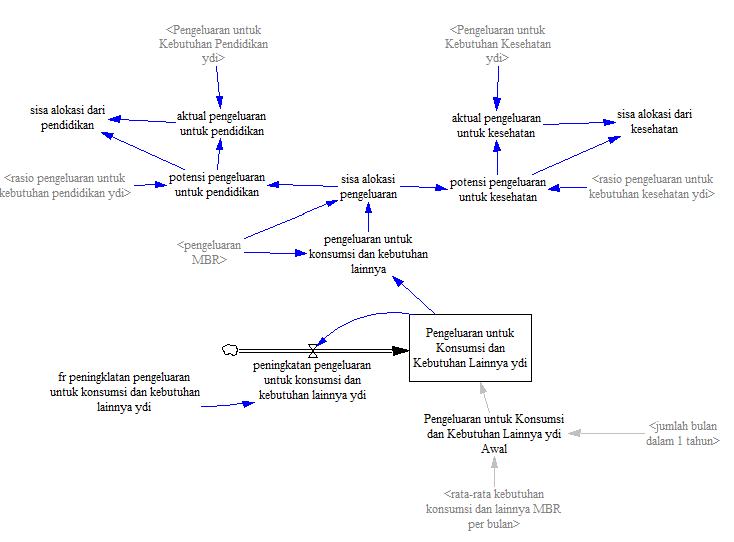
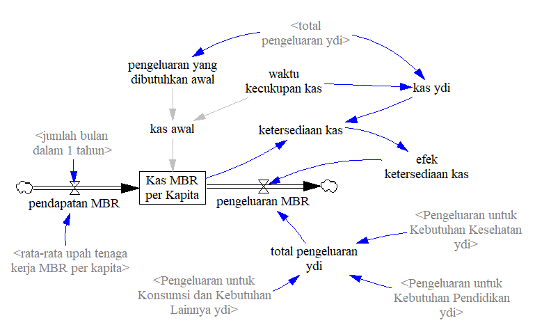

# BPIW-SysdynModel-2023

Pembangunan model *system dynamics*  sektor Perumahan dan Prasara Umum (PSU) untuk Masyarakat Berpenghasilan Rendah (MBR).

<strong>Gambar 1</strong> CLD Model Perumahan

Model dibangun dan dikembangkan menjadi **3 (tiga)** sub model besar:

- [BPIW-SysdynModel-2023](#bpiw-sysdynmodel-2023)
  - [Penyediaan Unit Hunian :house\_with\_garden:](#penyediaan-unit-hunian-house_with_garden)
  - [Kualitas Penduduk MBR :information\_desk\_person:](#kualitas-penduduk-mbr-information_desk_person)
      - [Kualitas SDM MBR :mechanic:](#kualitas-sdm-mbr-mechanic)
      - [Kesejahteraan MBR :man\_dancing:](#kesejahteraan-mbr-man_dancing)
  - [Kas MBR :moneybag:](#kas-mbr-moneybag)
      - [Alokasi Pengeluaran Kesehatan dan Pendidikan :receipt:](#alokasi-pengeluaran-kesehatan-dan-pendidikan-receipt)
      - [Alokasi Pengeluaran Konsumsi dan Kebutuhan Lainnya :receipt:](#alokasi-pengeluaran-konsumsi-dan-kebutuhan-lainnya-receipt)
      - [Kas MBR :money\_with\_wings:](#kas-mbr-money_with_wings)

## Penyediaan Unit Hunian :house_with_garden:

Sub model Penyediaan Unit Hunian merupakan sub model yang menggambarkan dinamika dari ***fenomena  *backlog*** hunian yang terjadi pada MBR.

<strong>Gambar 2</strong> SFD Penyediaan Unit Hunian

*Backlog* unit hunian terjadi karena adanya *gap* antrtara kebutuhan hunian MBR dengan jumlah hunian yang tersedian. Sehingga banyak masyarakat MBR yang hidupnya masih menumpang. Pembangunan hunian dapat dilakukan untuk mengatasi backlog tersebut, namun demikian terdapat hal-hal yang harus dipertimbangkan dalam pembangunan hunian tersebut, baik dari segi biaya maupun dari segi ketersediaan lahannya.

Pada model saat ini asumsi yang diterapkan adalah rumah yang dibangun merupakan bangunan yang berbentuk rumah susun (rusun). Disisi lain pengembangan model masih dapat dilakukan dengan memberikan *flow* masuk kepada sub model ini terkait kemampuan MBR dalam membeli hunian. Hal tersebut dilakukan karena walaupun hunian tersedia, namun jika MBR tidak dapat memiliki kases ke hunian tersebut, maka backlog akan tetap terjadi.

## Kualitas Penduduk MBR :information_desk_person:

Sub model Kualitas Penduduk MBR menggambarkan dinamika transisi dari populasi MBR menjadi populasi masyarakat yang sejahtera. Parameter yang menentukan transisi tersebut diambil dari **rasio UMK dengan pendapatan MBR per bulan per kapita**.

Terdapat 2 (dua) submodel mikro pada sub model Kualitas Penduduk MBR, yaitu; Kualitas SDM MBR dan Kesejahteraan MBR.  

#### Kualitas SDM MBR :mechanic:

Kualitas SDM MBR menggambarkan peningkatan kapasitas diri MBR dalam bermasyarakat. Peningkatan yang dimaksudkan adalah peningkatan keahlian, penjagaan kesehatan, dan peningkatan diri dari lingkungan yang baik dan kondusif. 

<strong>Gambar 3</strong> SFD Kualitas SDM MBR

Peningkatan kualitas SDM akan meningkatkan produktivitas MBR dari waktu ke waktu. **Peningkatan produktivitas** tersebut akan menjadi input pada sub model kesejahteraan MBR berikut.

#### Kesejahteraan MBR :man_dancing:

Kesejahteraan MBR dihitung dengan melihat perbandingan antara UMK dengan pendapatan tenaga kerja MBR per kapita. Parameter peningkatan produktivitas pada Kualitas SDM MBR dapat meningkatkan pendapatan tenaga kerja MBR per kapita. Sehingga jika pendapata tenaga kerja MBR per kapita lebih besar dari UMK, maka populasi MBR akan berkurang karena penduduk tersebut sudah sejahtera.

<strong>Gambar 4</strong> SFD Kesejahteraan MBR

Asumsi yang digunakan pada sub model ini merupakan agregat dari total populasi. Dengan kata lain *perhitungan dilakukan berdasarkan perorangan atau per kapita, kemudian perhitungan perkapita tersebut diagregasikan ke keseluruhan Populasi MBR*.

## Kas MBR :moneybag:

Submodel Kas MBR merupakan sub model yang menggambarkan dinamika *cash flow* yang dilakukan oleh **MBR per kapita**, baik untuk kebutuhan pangan, papan, dan sandang. Model Kas MBR ini dapat dikembangkan lebih lanjut untuk menghitungan *tabungan MBR dan kemampuan MBR untuk membeli hunian*.

Terdapat 3 (tiga) submodel mikro pada sub model Kas MBR, yaitu;Alokasi Pengeluaran Kesehatan dan Pendidikan, Alokasi Pengeluaran Konsumsi dan Kebutuhan Lainnya dan Kas MBR. 

#### Alokasi Pengeluaran Kesehatan dan Pendidikan :receipt:

Pengelauran Kesehatan dan Pendidikan merupakan pengeluaran dengan prioritas kedua setelah pengeluaran untuk konsumsi. Pengeluaran ini merupakan pengeluaran yang memilkiki sifat investasi diri. Pengeluaran ini nantinya akan membangun peningkatan kualitas SDM dari segi kesehatan maupun pendidikan. 

<strong>Gambar 5</strong> SFD Alokasi Pengeluaran Kesehatan dan Pendidikan

Seperti yang sudah dijelaskan sebelumnya, pengeluaran ini merupakan pengeluaran dengan prioritas kedua setelah pengeluaran untuk konsumsi, sehingga terdapat hirarki dalam melakukan alokasi pengeluaran masyarakat MBR. Hirarki tersebut akan dijelaskan setelah ini.

#### Alokasi Pengeluaran Konsumsi dan Kebutuhan Lainnya :receipt:

Alokasi pengeluaran yang menjadi prioritas pertama adalah alokasi untuk konsumsi dan kebutuhan lainnya. Alokasi tersebut merupakan alokasi utama yang harus dipenuhi. Sehingga dari pendapatan yang diterima, harus memenuhi kebutuhan konsumsi dan lainnya.

<strong>Gambar 6</strong> SFD Alokasi Pengeluarann Konsumsi dan Lainnya

Pengeluaran yang dilakukan untuk konsumsi dan lainnya langsung digerakan oleh pengeluaran dan pendapatan, namun untuk kesehatan dan pendidikan memiliki prioritas yang sama namun pengeluaran aktual yang dilakukan menggunakan sisa dari pengeluaran konsumsi dan lainnya.

#### Kas MBR :money_with_wings:

Kas MBR merupakan struktur yang menggambarkan dinamika ketersediaan kas yang dapat digunakan. Parameter yang mengatur seberapa besar uang yang dapat dikeluarkan terdapat pada ketersediaan kas. Sehingga jika kas tidak tersedia, Kas MBR per kapita tidak akan menuju ke nilai negatif. Stok KAS MBR per Kapita menjadi sangat pengting dalam menentukan kemampuan MBR dalam finansial. 

<strong>Gambar 7</strong> SFD KAS MBR

Model yang dibangun sudah dilakukan uji ***dimensional consistency*** sehingga secara satuan model sudah valid. Namun minimal beberapa pengujian lain harus dilakukan seperti structure verivication, parameter verification, dan behavior reproduction. Dengan demikian data yang digunakan pada membangunan model ini masih belum banyak. Sehingga ***model ini masih merupakan model konseptual.***